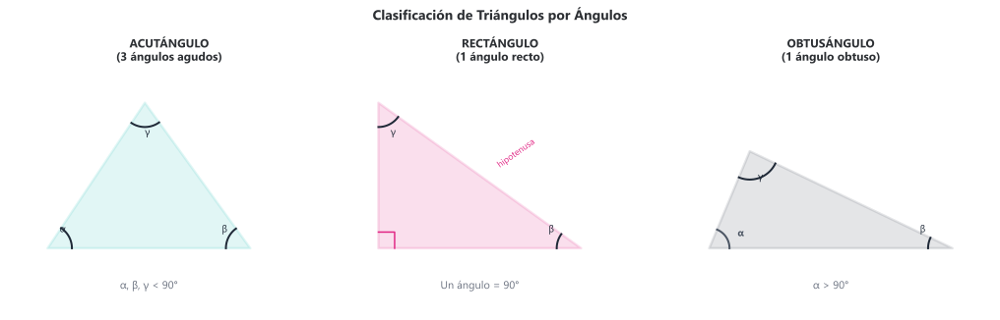
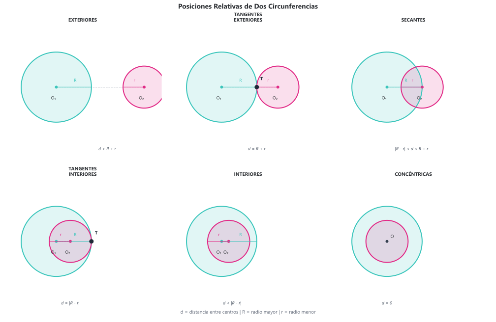
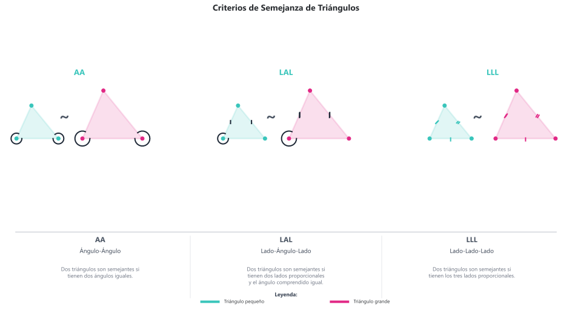

# Teoría de Geometría
## 4.1 Conceptos fundamentales

### Elementos primitivos

| Elemento | Descripción | Notación |
|----------|-------------|----------|
| **Punto** | Posición sin dimensiones | $A$, $B$, $P$ |
| **Recta** | Conjunto infinito de puntos en una dirección | $\overleftrightarrow{AB}$ o $\ell$ |
| **Plano** | Superficie infinita bidimensional | $\pi$, $\alpha$ |

### Segmentos y rayos

- **Segmento**: Porción de recta entre dos puntos. Notación: $\overline{AB}$
- **Rayo**: Porción de recta que inicia en un punto y se extiende infinitamente. Notación: $\overrightarrow{AB}$
- **Longitud de segmento**: $\lvert \overline{AB} \rvert$ o simplemente $AB$

### Punto medio

El punto $M$ es **punto medio** de $\overline{AB}$ si:
$$AM = MB = \frac{AB}{2}$$

### Posiciones relativas

**Entre rectas:**
| Posición | Descripción |
|----------|-------------|
| Paralelas | No se intersectan, misma dirección ($\ell_1 \parallel \ell_2$) |
| Secantes | Se intersectan en un punto |
| Perpendiculares | Se intersectan formando ángulo de 90° ($\ell_1 \perp \ell_2$) |

---

## 4.2 Ángulos

### Definición

Un **ángulo** es la unión de dos rayos con origen común (vértice).

Notación: $\angle ABC$ o $\angle B$ (vértice en el centro)

### Clasificación por medida

| Tipo | Medida | Ejemplo |
|------|--------|---------|
| Agudo | $0° < \alpha < 90°$ | 45° |
| Recto | $\alpha = 90°$ | 90° |
| Obtuso | $90° < \alpha < 180°$ | 120° |
| Llano | $\alpha = 180°$ | 180° |
| Cóncavo (reflejo) | $180° < \alpha < 360°$ | 270° |

### Ángulos complementarios y suplementarios

- **Complementarios**: $\alpha + \beta = 90°$
- **Suplementarios**: $\alpha + \beta = 180°$

### Ángulos formados por paralelas y transversal

Cuando una transversal corta a dos rectas paralelas:

| Tipo | Posición | Relación |
|------|----------|----------|
| **Correspondientes** | Mismo lado, uno interior y uno exterior | Iguales |
| **Alternos internos** | Lados opuestos, ambos interiores | Iguales |
| **Alternos externos** | Lados opuestos, ambos exteriores | Iguales |
| **Conjugados internos** | Mismo lado, ambos interiores | Suplementarios |

### Ángulos en polígonos

**Suma de ángulos interiores** de un polígono de $n$ lados:
$$S_i = (n - 2) \cdot 180°$$

**Suma de ángulos exteriores** (siempre):
$$S_e = 360°$$

---

## 4.3 Triángulos

### Clasificación por lados

| Tipo | Característica |
|------|----------------|
| **Equilátero** | Tres lados iguales |
| **Isósceles** | Dos lados iguales |
| **Escaleno** | Todos los lados diferentes |

### Clasificación por ángulos

| Tipo | Característica |
|------|----------------|
| **Acutángulo** | Tres ángulos agudos |
| **Rectángulo** | Un ángulo recto |
| **Obtusángulo** | Un ángulo obtuso |

### Propiedades fundamentales

1. **Suma de ángulos interiores**: $\alpha + \beta + \gamma = 180°$
2. **Desigualdad triangular**: $a + b > c$ (para cualquier par de lados)
3. **Ángulo exterior**: Igual a la suma de los dos ángulos interiores no adyacentes

### Líneas notables

| Línea | Definición | Punto de concurrencia |
|-------|------------|----------------------|
| **Mediana** | Une vértice con punto medio del lado opuesto | Centroide (G) |
| **Altura** | Perpendicular desde vértice al lado opuesto | Ortocentro (H) |
| **Mediatriz** | Perpendicular en punto medio de un lado | Circuncentro (O) |
| **Bisectriz** | Divide un ángulo en dos partes iguales | Incentro (I) |

### Propiedades del centroide

El centroide divide cada mediana en razón $2:1$ desde el vértice.

### Criterios de congruencia

Dos triángulos son congruentes si cumplen:

| Criterio | Significado |
|----------|-------------|
| **LLL** | Tres lados iguales |
| **LAL** | Dos lados y ángulo comprendido iguales |
| **ALA** | Dos ángulos y lado comprendido iguales |
| **AAL** | Dos ángulos y lado opuesto iguales |

---

## 4.4 Cuadriláteros

### Clasificación

Cuadriláteros se clasifican principalmente en paralelogramos, trapecios y trapezoides.

### Propiedades de paralelogramos

| Propiedad | Descripción |
|-----------|-------------|
| Lados opuestos | Iguales y paralelos |
| Ángulos opuestos | Iguales |
| Ángulos consecutivos | Suplementarios |
| Diagonales | Se bisecan mutuamente |

### Propiedades especiales

| Figura | Diagonales |
|--------|------------|
| **Rectángulo** | Iguales |
| **Rombo** | Perpendiculares |
| **Cuadrado** | Iguales y perpendiculares |

### Trapecio

- **Base mayor** y **base menor**: lados paralelos
- **Mediana del trapecio**: $m = \frac{B + b}{2}$

---

## 4.5 Polígonos

### Polígono regular

Un polígono es **regular** si todos sus lados y ángulos son iguales.

### Fórmulas para polígono de $n$ lados

| Propiedad | Fórmula |
|-----------|---------|
| Suma de ángulos interiores | $(n-2) \cdot 180°$ |
| Cada ángulo interior (regular) | $\frac{(n-2) \cdot 180°}{n}$ |
| Suma de ángulos exteriores | $360°$ |
| Cada ángulo exterior (regular) | $\frac{360°}{n}$ |
| Número de diagonales | $\frac{n(n-3)}{2}$ |

### Polígonos comunes

| Nombre | Lados | Ángulo interior (regular) |
|--------|-------|---------------------------|
| Triángulo | 3 | 60° |
| Cuadrado | 4 | 90° |
| Pentágono | 5 | 108° |
| Hexágono | 6 | 120° |
| Octágono | 8 | 135° |
| Decágono | 10 | 144° |
| Dodecágono | 12 | 150° |

---

## 4.6 Circunferencia y círculo

### Elementos

| Elemento | Definición |
|----------|------------|
| **Centro** | Punto equidistante de todos los puntos de la circunferencia |
| **Radio** ($r$) | Distancia del centro a cualquier punto de la circunferencia |
| **Diámetro** ($d$) | Cuerda que pasa por el centro; $d = 2r$ |
| **Cuerda** | Segmento que une dos puntos de la circunferencia |
| **Arco** | Porción de la circunferencia |
| **Secante** | Recta que corta la circunferencia en dos puntos |
| **Tangente** | Recta que toca la circunferencia en un solo punto |

### Propiedades de la tangente

- La tangente es perpendicular al radio en el punto de tangencia
- Desde un punto exterior, las dos tangentes tienen igual longitud

### Ángulos en la circunferencia

| Tipo de ángulo | Medida |
|----------------|--------|
| **Central** | Igual al arco que subtiende |
| **Inscrito** | Mitad del arco que subtiende |
| **Semi-inscrito** | Mitad del arco que subtiende |
| **Interior** | Semisuma de los arcos que determina |
| **Exterior** | Semidiferencia de los arcos que determina |

### Teoremas importantes

**Teorema del ángulo inscrito:**
$$\text{Ángulo inscrito} = \frac{\text{Arco}}{2}$$

**Ángulo inscrito en semicírculo:** Un ángulo inscrito que subtiende un diámetro es recto (90°).

---

## 4.7 Áreas de figuras planas

### Fórmulas de área

| Figura | Fórmula | Variables |
|--------|---------|-----------|
| **Cuadrado** | $A = l^2$ | $l$ = lado |
| **Rectángulo** | $A = b \cdot h$ | $b$ = base, $h$ = altura |
| **Triángulo** | $A = \frac{b \cdot h}{2}$ | $b$ = base, $h$ = altura |
| **Paralelogramo** | $A = b \cdot h$ | $b$ = base, $h$ = altura |
| **Rombo** | $A = \frac{D \cdot d}{2}$ | $D$, $d$ = diagonales |
| **Trapecio** | $A = \frac{(B + b) \cdot h}{2}$ | $B$, $b$ = bases, $h$ = altura |
| **Polígono regular** | $A = \frac{P \cdot a}{2}$ | $P$ = perímetro, $a$ = apotema |
| **Círculo** | $A = \pi r^2$ | $r$ = radio |
| **Sector circular** | $A = \frac{\theta}{360°} \pi r^2$ | $\theta$ = ángulo central |

### Fórmula de Herón (triángulo)

Para un triángulo con lados $a$, $b$, $c$ y semiperímetro $s = \frac{a+b+c}{2}$:
$$A = \sqrt{s(s-a)(s-b)(s-c)}$$

### Perímetros

| Figura | Perímetro |
|--------|-----------|
| **Cuadrado** | $P = 4l$ |
| **Rectángulo** | $P = 2(b + h)$ |
| **Triángulo** | $P = a + b + c$ |
| **Circunferencia** | $C = 2\pi r = \pi d$ |
| **Polígono regular** | $P = n \cdot l$ |

---

## 4.8 Semejanza

### Definición

Dos figuras son **semejantes** si tienen la misma forma pero diferente tamaño.

### Razón de semejanza

Si dos figuras son semejantes con razón $k$:
- Lados correspondientes: $\frac{a'}{a} = k$
- Áreas correspondientes: $\frac{A'}{A} = k^2$
- Volúmenes correspondientes: $\frac{V'}{V} = k^3$

### Criterios de semejanza de triángulos

| Criterio | Significado |
|----------|-------------|
| **AA** | Dos ángulos iguales |
| **LAL** | Dos lados proporcionales y ángulo comprendido igual |
| **LLL** | Tres lados proporcionales |

### Teorema de Tales

Si una recta es paralela a uno de los lados de un triángulo, divide a los otros dos lados en segmentos proporcionales.

$$\frac{AD}{DB} = \frac{AE}{EC}$$

---

## 4.9 Teorema de Pitágoras

### Enunciado

En un triángulo rectángulo, el cuadrado de la hipotenusa es igual a la suma de los cuadrados de los catetos:
$$c^2 = a^2 + b^2$$

donde $c$ es la hipotenusa y $a$, $b$ son los catetos.

### Recíproco

Si en un triángulo se cumple $c^2 = a^2 + b^2$, entonces el triángulo es rectángulo.

### Clasificación de triángulos por el teorema

| Condición | Tipo de triángulo |
|-----------|-------------------|
| $c^2 = a^2 + b^2$ | Rectángulo |
| $c^2 < a^2 + b^2$ | Acutángulo |
| $c^2 > a^2 + b^2$ | Obtusángulo |

### Ternas pitagóricas

| Terna | Múltiplos |
|-------|-----------|
| $(3, 4, 5)$ | $(6, 8, 10)$, $(9, 12, 15)$, ... |
| $(5, 12, 13)$ | $(10, 24, 26)$, ... |
| $(8, 15, 17)$ | $(16, 30, 34)$, ... |
| $(7, 24, 25)$ | $(14, 48, 50)$, ... |

### Relaciones métricas en el triángulo rectángulo

Si $h$ es la altura sobre la hipotenusa, y $m$, $n$ son las proyecciones de los catetos:

$$h^2 = m \cdot n$$
$$a^2 = m \cdot c$$
$$b^2 = n \cdot c$$
$$a \cdot b = c \cdot h$$

---

## 4.10 Geometría del espacio

### Sólidos y sus propiedades

#### Prisma

| Propiedad | Fórmula |
|-----------|---------|
| Volumen | $V = A_b \cdot h$ |
| Área lateral | $A_L = P_b \cdot h$ |
| Área total | $A_T = A_L + 2A_b$ |

#### Pirámide

| Propiedad | Fórmula |
|-----------|---------|
| Volumen | $V = \frac{1}{3} A_b \cdot h$ |
| Área lateral | $A_L = \frac{1}{2} P_b \cdot a_p$ ($a_p$ = apotema de la pirámide) |

#### Cilindro

| Propiedad | Fórmula |
|-----------|---------|
| Volumen | $V = \pi r^2 h$ |
| Área lateral | $A_L = 2\pi r h$ |
| Área total | $A_T = 2\pi r(r + h)$ |

#### Cono

| Propiedad | Fórmula |
|-----------|---------|
| Volumen | $V = \frac{1}{3} \pi r^2 h$ |
| Área lateral | $A_L = \pi r g$ ($g$ = generatriz) |
| Generatriz | $g = \sqrt{r^2 + h^2}$ |

#### Esfera

| Propiedad | Fórmula |
|-----------|---------|
| Volumen | $V = \frac{4}{3} \pi r^3$ |
| Área superficial | $A = 4\pi r^2$ |

### Principio de Cavalieri

Dos sólidos con igual altura tienen igual volumen si todas las secciones paralelas a la base tienen igual área.
