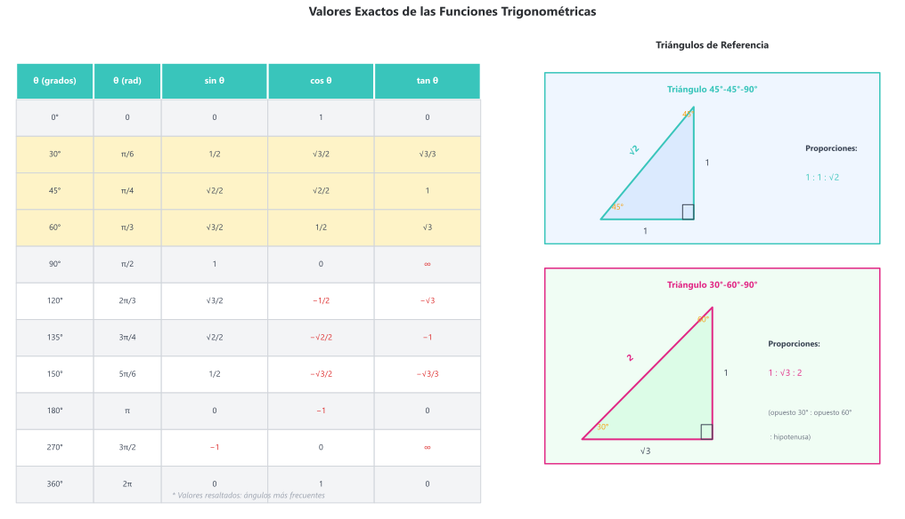

# Teoría de Trigonometría
## 5.1 Conceptos fundamentales

### Definición de ángulo

Un **ángulo** es la rotación de un rayo desde una posición inicial hasta una posición final alrededor de un punto fijo (vértice).

| Término | Descripción |
|---------|-------------|
| **Lado inicial** | Posición de partida del rayo (generalmente eje $x$ positivo) |
| **Lado terminal** | Posición final del rayo después de la rotación |
| **Ángulo positivo** | Rotación en sentido antihorario |
| **Ángulo negativo** | Rotación en sentido horario |

### Sistemas de medición angular

**Grados sexagesimales:**
- Una vuelta completa = $360°$
- Un grado = $60'$ (minutos)
- Un minuto = $60''$ (segundos)

**Radianes:**
- Una vuelta completa = $2\pi$ rad
- Un radián = ángulo central que subtiende un arco igual al radio

**Conversión:**
$$\boxed{180° = \pi \text{ rad}}$$

$$\theta_{\text{rad}} = \theta_{\text{grados}} \cdot \frac{\pi}{180°}$$

$$\theta_{\text{grados}} = \theta_{\text{rad}} \cdot \frac{180°}{\pi}$$

### Ángulos notables

| Grados | Radianes |
|:------:|:--------:|
| $0°$ | $0$ |
| $30°$ | $\frac{\pi}{6}$ |
| $45°$ | $\frac{\pi}{4}$ |
| $60°$ | $\frac{\pi}{3}$ |
| $90°$ | $\frac{\pi}{2}$ |
| $180°$ | $\pi$ |
| $270°$ | $\frac{3\pi}{2}$ |
| $360°$ | $2\pi$ |

---

## 5.2 Razones trigonométricas en triángulos rectángulos

### Definición

Para un triángulo rectángulo con un ángulo agudo $\theta$:

$$\sin\theta = \frac{\text{cateto opuesto}}{\text{hipotenusa}} = \frac{a}{c}$$

$$\cos\theta = \frac{\text{cateto adyacente}}{\text{hipotenusa}} = \frac{b}{c}$$

$$\tan\theta = \frac{\text{cateto opuesto}}{\text{cateto adyacente}} = \frac{a}{b}$$

### Razones recíprocas

$$\csc\theta = \frac{1}{\sin\theta} = \frac{c}{a}$$

$$\sec\theta = \frac{1}{\cos\theta} = \frac{c}{b}$$

$$\cot\theta = \frac{1}{\tan\theta} = \frac{b}{a}$$

### Tabla de valores exactos

| $\theta$ | $\sin\theta$ | $\cos\theta$ | $\tan\theta$ |
|:--------:|:------------:|:------------:|:------------:|
| $0°$ | $0$ | $1$ | $0$ |
| $30°$ | $\frac{1}{2}$ | $\frac{\sqrt{3}}{2}$ | $\frac{\sqrt{3}}{3}$ |
| $45°$ | $\frac{\sqrt{2}}{2}$ | $\frac{\sqrt{2}}{2}$ | $1$ |
| $60°$ | $\frac{\sqrt{3}}{2}$ | $\frac{1}{2}$ | $\sqrt{3}$ |
| $90°$ | $1$ | $0$ | $\nexists$ |

### Técnica mnemotécnica

**SOH-CAH-TOA:**
- **S**eno = **O**puesto / **H**ipotenusa
- **C**oseno = **A**dyacente / **H**ipotenusa
- **T**angente = **O**puesto / **A**dyacente

*Figura 5.2.1: Triángulo rectángulo con las razones trigonométricas seno, coseno y tangente.*

---

## 5.3 Funciones trigonométricas en el círculo unitario

### Definición general

Para cualquier ángulo $\theta$ en posición estándar, si $(x, y)$ es el punto donde el lado terminal intersecta el círculo unitario:

$$\sin\theta = y \qquad \cos\theta = x \qquad \tan\theta = \frac{y}{x}$$

### Signos por cuadrante

| Cuadrante | $\sin\theta$ | $\cos\theta$ | $\tan\theta$ |
|:---------:|:------------:|:------------:|:------------:|
| I ($0° - 90°$) | $+$ | $+$ | $+$ |
| II ($90° - 180°$) | $+$ | $-$ | $-$ |
| III ($180° - 270°$) | $-$ | $-$ | $+$ |
| IV ($270° - 360°$) | $-$ | $+$ | $-$ |

**Regla mnemotécnica "ASTC"** (All Students Take Calculus):
- **A**ll (I): todas positivas
- **S**in (II): solo seno positivo
- **T**an (III): solo tangente positiva
- **C**os (IV): solo coseno positivo

### Ángulos de referencia

El **ángulo de referencia** $\theta_r$ es el ángulo agudo formado entre el lado terminal y el eje $x$.

| Cuadrante | Ángulo de referencia |
|:---------:|:--------------------:|
| I | $\theta_r = \theta$ |
| II | $\theta_r = 180° - \theta$ |
| III | $\theta_r = \theta - 180°$ |
| IV | $\theta_r = 360° - \theta$ |

*Figura 5.3.1: Círculo unitario mostrando las coordenadas $(\cos\theta, \sin\theta)$ y los signos por cuadrante.*

---

## 5.4 Identidades trigonométricas fundamentales

### Identidades pitagóricas

$$\boxed{\sin^2\theta + \cos^2\theta = 1}$$

$$1 + \tan^2\theta = \sec^2\theta$$

$$1 + \cot^2\theta = \csc^2\theta$$

### Identidades de cociente

$$\tan\theta = \frac{\sin\theta}{\cos\theta}$$

$$\cot\theta = \frac{\cos\theta}{\sin\theta}$$

### Identidades recíprocas

$$\sin\theta \cdot \csc\theta = 1$$
$$\cos\theta \cdot \sec\theta = 1$$
$$\tan\theta \cdot \cot\theta = 1$$

### Identidades de paridad

| Función par | Función impar |
|:-----------:|:-------------:|
| $\cos(-\theta) = \cos\theta$ | $\sin(-\theta) = -\sin\theta$ |
| $\sec(-\theta) = \sec\theta$ | $\tan(-\theta) = -\tan\theta$ |
| | $\cot(-\theta) = -\cot\theta$ |
| | $\csc(-\theta) = -\csc\theta$ |

*Figura 5.4.1: Representación geométrica de la identidad fundamental $\sin^2\theta + \cos^2\theta = 1$.*

---

## 5.5 Identidades de suma y diferencia

### Suma de ángulos

$$\sin(\alpha + \beta) = \sin\alpha\cos\beta + \cos\alpha\sin\beta$$

$$\cos(\alpha + \beta) = \cos\alpha\cos\beta - \sin\alpha\sin\beta$$

$$\tan(\alpha + \beta) = \frac{\tan\alpha + \tan\beta}{1 - \tan\alpha\tan\beta}$$

### Diferencia de ángulos

$$\sin(\alpha - \beta) = \sin\alpha\cos\beta - \cos\alpha\sin\beta$$

$$\cos(\alpha - \beta) = \cos\alpha\cos\beta + \sin\alpha\sin\beta$$

$$\tan(\alpha - \beta) = \frac{\tan\alpha - \tan\beta}{1 + \tan\alpha\tan\beta}$$

*Figura 5.5.1: Interpretación geométrica de las identidades de suma y diferencia de ángulos.*

---

## 5.6 Identidades de ángulo doble y mitad

### Ángulo doble

$$\sin(2\theta) = 2\sin\theta\cos\theta$$

$$\cos(2\theta) = \cos^2\theta - \sin^2\theta = 2\cos^2\theta - 1 = 1 - 2\sin^2\theta$$

$$\tan(2\theta) = \frac{2\tan\theta}{1 - \tan^2\theta}$$

### Ángulo mitad

$$\sin\frac{\theta}{2} = \pm\sqrt{\frac{1 - \cos\theta}{2}}$$

$$\cos\frac{\theta}{2} = \pm\sqrt{\frac{1 + \cos\theta}{2}}$$

$$\tan\frac{\theta}{2} = \pm\sqrt{\frac{1 - \cos\theta}{1 + \cos\theta}} = \frac{\sin\theta}{1 + \cos\theta} = \frac{1 - \cos\theta}{\sin\theta}$$

> **Nota:** El signo $\pm$ depende del cuadrante donde se ubica $\frac{\theta}{2}$.

*Figura 5.6.1: Visualización de las identidades de ángulo doble: $\sin(2\theta)$ y $\cos(2\theta)$.*

---

## 5.7 Transformaciones producto-suma

### Producto a suma

$$\sin\alpha\cos\beta = \frac{1}{2}[\sin(\alpha + \beta) + \sin(\alpha - \beta)]$$

$$\cos\alpha\cos\beta = \frac{1}{2}[\cos(\alpha - \beta) + \cos(\alpha + \beta)]$$

$$\sin\alpha\sin\beta = \frac{1}{2}[\cos(\alpha - \beta) - \cos(\alpha + \beta)]$$

### Suma a producto

$$\sin A + \sin B = 2\sin\frac{A+B}{2}\cos\frac{A-B}{2}$$

$$\sin A - \sin B = 2\cos\frac{A+B}{2}\sin\frac{A-B}{2}$$

$$\cos A + \cos B = 2\cos\frac{A+B}{2}\cos\frac{A-B}{2}$$

$$\cos A - \cos B = -2\sin\frac{A+B}{2}\sin\frac{A-B}{2}$$

---

## 5.8 Resolución de triángulos oblicuángulos

### Ley de senos

Para cualquier triángulo con lados $a, b, c$ opuestos a los ángulos $A, B, C$:

$$\boxed{\frac{a}{\sin A} = \frac{b}{\sin B} = \frac{c}{\sin C} = 2R}$$

donde $R$ es el radio de la circunferencia circunscrita.

**Casos de aplicación:**
- **ALA**: Dos ángulos y un lado
- **LLA**: Dos lados y ángulo opuesto (caso ambiguo)

### Caso ambiguo (LLA)

Cuando se conocen dos lados $a, b$ y el ángulo $A$ opuesto al lado $a$:

| Condición | Soluciones |
|-----------|:----------:|
| $a < b\sin A$ | 0 (imposible) |
| $a = b\sin A$ | 1 (triángulo rectángulo) |
| $b\sin A < a < b$ | 2 (caso ambiguo) |
| $a \geq b$ | 1 |

### Ley de cosenos

$$\boxed{c^2 = a^2 + b^2 - 2ab\cos C}$$

Formas equivalentes:
$$a^2 = b^2 + c^2 - 2bc\cos A$$
$$b^2 = a^2 + c^2 - 2ac\cos B$$

**Para encontrar ángulos:**
$$\cos C = \frac{a^2 + b^2 - c^2}{2ab}$$

**Casos de aplicación:**
- **LAL**: Dos lados y ángulo comprendido
- **LLL**: Tres lados conocidos

### Ley de tangentes

$$\frac{a - b}{a + b} = \frac{\tan\frac{A-B}{2}}{\tan\frac{A+B}{2}}$$

*Figura 5.8.1: Ley de senos: $\frac{a}{\sin A} = \frac{b}{\sin B} = \frac{c}{\sin C} = 2R$.*

*Figura 5.8.2: Ley de cosenos: $c^2 = a^2 + b^2 - 2ab\cos C$.*

---

## 5.9 Áreas de triángulos

### Fórmulas de área

**Con base y altura:**
$$A = \frac{1}{2}bh$$

**Con dos lados y ángulo comprendido:**
$$A = \frac{1}{2}ab\sin C = \frac{1}{2}bc\sin A = \frac{1}{2}ac\sin B$$

**Fórmula de Herón** (conociendo los tres lados):
$$A = \sqrt{s(s-a)(s-b)(s-c)}$$

donde $s = \frac{a + b + c}{2}$ es el semiperímetro.

---

## 5.10 Funciones trigonométricas inversas

### Definiciones y dominios

| Función | Notación | Dominio | Rango |
|---------|:--------:|:-------:|:-----:|
| Arcoseno | $\arcsin x$ o $\sin^{-1}x$ | $[-1, 1]$ | $[-\frac{\pi}{2}, \frac{\pi}{2}]$ |
| Arcocoseno | $\arccos x$ o $\cos^{-1}x$ | $[-1, 1]$ | $[0, \pi]$ |
| Arcotangente | $\arctan x$ o $\tan^{-1}x$ | $\mathbb{R}$ | $(-\frac{\pi}{2}, \frac{\pi}{2})$ |
| Arcocotangente | $\text{arccot}\, x$ o $\cot^{-1}x$ | $\mathbb{R}$ | $(0, \pi)$ |
| Arcosecante | $\text{arcsec}\, x$ o $\sec^{-1}x$ | $\lvert x \rvert \geq 1$ | $[0, \frac{\pi}{2}) \cup (\frac{\pi}{2}, \pi]$ |
| Arcocosecante | $\text{arccsc}\, x$ o $\csc^{-1}x$ | $\lvert x \rvert \geq 1$ | $[-\frac{\pi}{2}, 0) \cup (0, \frac{\pi}{2}]$ |

### Propiedades importantes

$$\sin(\arcsin x) = x \quad \text{para } x \in [-1, 1]$$
$$\arcsin(\sin\theta) = \theta \quad \text{para } \theta \in [-\frac{\pi}{2}, \frac{\pi}{2}]$$

### Identidades útiles

$$\arcsin x + \arccos x = \frac{\pi}{2}$$

$$\arctan x + \arctan\frac{1}{x} = \begin{cases} \frac{\pi}{2} & \text{si } x > 0 \\ -\frac{\pi}{2} & \text{si } x < 0 \end{cases}$$

*Figura 5.10.1: Gráficas de las funciones inversas $\arcsin x$, $\arccos x$ y $\arctan x$.*

---

## 5.11 Gráficas de funciones trigonométricas

### Función seno: $y = A\sin(Bx + C) + D$

| Parámetro | Efecto | Fórmula |
|-----------|--------|---------|
| $A$ | Amplitud | $\lvert A \rvert$ |
| $B$ | Frecuencia angular | Periodo $= \frac{2\pi}{\lvert B \rvert}$ |
| $C$ | Desfase horizontal | Desfase $= -\frac{C}{B}$ |
| $D$ | Desplazamiento vertical | Línea media |

### Características de las funciones básicas

| Función | Periodo | Amplitud | Dominio | Rango |
|---------|:-------:|:--------:|---------|-------|
| $\sin x$ | $2\pi$ | $1$ | $\mathbb{R}$ | $[-1, 1]$ |
| $\cos x$ | $2\pi$ | $1$ | $\mathbb{R}$ | $[-1, 1]$ |
| $\tan x$ | $\pi$ | $\nexists$ | $x \neq \frac{\pi}{2} + n\pi$ | $\mathbb{R}$ |
| $\cot x$ | $\pi$ | $\nexists$ | $x \neq n\pi$ | $\mathbb{R}$ |
| $\sec x$ | $2\pi$ | $\nexists$ | $x \neq \frac{\pi}{2} + n\pi$ | $(-\infty, -1] \cup [1, \infty)$ |
| $\csc x$ | $2\pi$ | $\nexists$ | $x \neq n\pi$ | $(-\infty, -1] \cup 1, \infty)$ |

*Figura 5.11.1: Gráficas de las funciones seno y coseno mostrando amplitud, periodo y desfase.*

*Figura 5.11.2: Gráficas de las funciones tangente y secante con sus asíntotas verticales.*

*Figura 5.11.3: Efecto de los parámetros $A$, $B$, $C$, $D$ en $y = A\sin(Bx + C) + D$.*

---

## 5.12 Ecuaciones trigonométricas

### Metodología general

1. Aislar la función trigonométrica
2. Encontrar soluciones en el intervalo fundamental
3. Escribir la [solución general usando periodicidad

### Soluciones generales

| Ecuación | Solución general |
|----------|------------------|
| $\sin\theta = a$ | $\theta = \arcsin a + 2n\pi$ o $\theta = \pi - \arcsin a + 2n\pi$ |
| $\cos\theta = a$ | $\theta = \pm\arccos a + 2n\pi$ |
| $\tan\theta = a$ | $\theta = \arctan a + n\pi$ |

donde $n \in \mathbb{Z}$.

---

> 📚 **Nota:** Este documento cubre trigonometría para nivel fundamentos.
