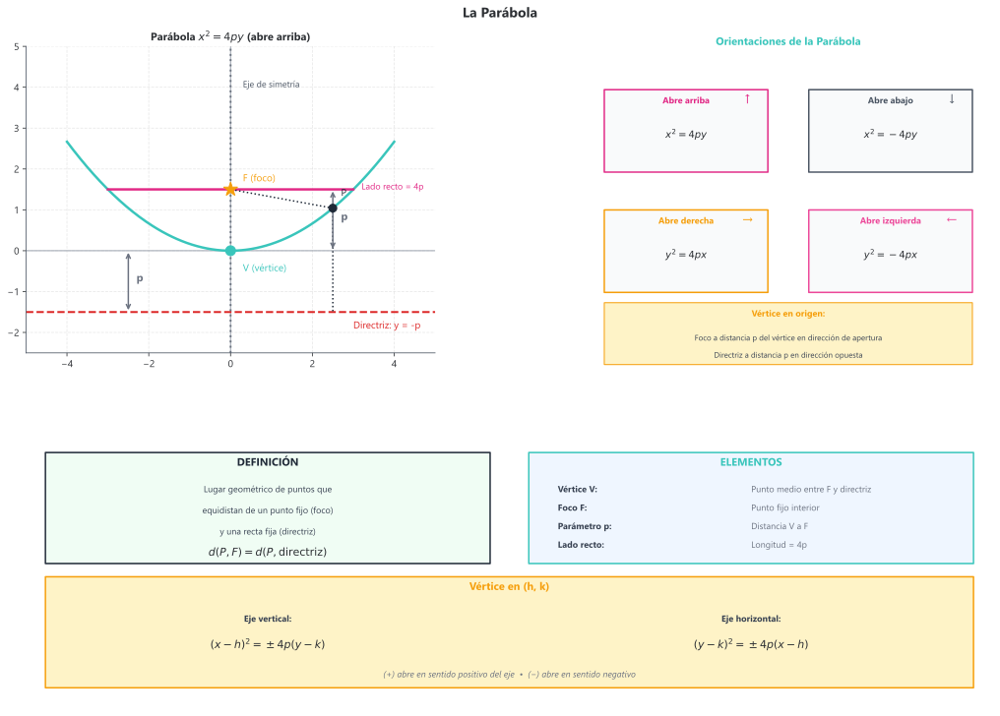

# Teoría de Geometría Analítica
## 6.1 Sistema de coordenadas cartesianas

### Definición

El **plano cartesiano** es un sistema de referencia formado por dos rectas numéricas perpendiculares:
- **Eje $x$ (abscisas)**: recta horizontal
- **Eje $y$ (ordenadas)**: recta vertical
- **Origen $O$**: punto de intersección $(0, 0)$

### Coordenadas de un punto

Todo punto $P$ en el plano se representa como un par ordenado $(x, y)$ donde:
- $x$ = distancia horizontal desde el eje $y$ (abscisa)
- $y$ = distancia vertical desde el eje $x$ (ordenada)

### Cuadrantes

| Cuadrante | Signos | Ubicación |
|:---------:|:------:|-----------|
| I | $(+, +)$ | Superior derecho |
| II | $(-, +)$ | Superior izquierdo |
| III | $(-, -)$ | Inferior izquierdo |
| IV | $(+, -)$ | Inferior derecho |

---

## 6.2 Fórmulas fundamentales

### Distancia entre dos puntos

La distancia entre $P_1(x_1, y_1)$ y $P_2(x_2, y_2)$ es:

$$\boxed{d = \sqrt{(x_2 - x_1)^2 + (y_2 - y_1)^2}}$$

> Esta fórmula se deriva del teorema de Pitágoras.

### Punto medio de un segmento

El punto medio $M$ del segmento $\overline{P_1P_2}$ es:

$$\boxed{M = \left(\frac{x_1 + x_2}{2}, \frac{y_1 + y_2}{2}\right)}$$

### División de un segmento en razón dada

El punto $P$ que divide al segmento $\overline{P_1P_2}$ en razón $r = \frac{m}{n}$ es:

$$P = \left(\frac{x_1 + rx_2}{1 + r}, \frac{y_1 + ry_2}{1 + r}\right)$$

o equivalentemente:

$$P = \left(\frac{nx_1 + mx_2}{m + n}, \frac{ny_1 + my_2}{m + n}\right)$$

### Área de un triángulo

Para un triángulo con vértices $A(x_1, y_1)$, $B(x_2, y_2)$, $C(x_3, y_3)$:

$$A = \frac{1}{2}\left|x_1(y_2 - y_3) + x_2(y_3 - y_1) + x_3(y_1 - y_2)\right|$$

**Forma de determinante:**
$$A = \frac{1}{2}\left|\begin{vmatrix} x_1 & y_1 & 1 \\ x_2 & y_2 & 1 \\ x_3 & y_3 & 1 \end{vmatrix}\right|$$

---

## 6.3 La línea recta

### Pendiente

La **pendiente** $m$ de una recta que pasa por $P_1(x_1, y_1)$ y $P_2(x_2, y_2)$ es:

$$\boxed{m = \frac{y_2 - y_1}{x_2 - x_1} = \frac{\Delta y}{\Delta x} = \tan\theta}$$

donde $\theta$ es el ángulo de inclinación respecto al eje $x$ positivo.

| Pendiente | Interpretación |
|-----------|----------------|
| $m > 0$ | Recta ascendente (de izquierda a derecha) |
| $m < 0$ | Recta descendente |
| $m = 0$ | Recta horizontal |
| $m$ no existe | Recta vertical |

### Formas de la ecuación de la recta

| Forma | Ecuación | Descripción |
|-------|----------|-------------|
| **Punto-pendiente** | $y - y_1 = m(x - x_1)$ | Conocidos un punto y la pendiente |
| **Pendiente-ordenada** | $y = mx + b$ | Conocidos pendiente y ordenada al origen |
| **Simétrica** | $\frac{x}{a} + \frac{y}{b} = 1$ | Conocidas las intersecciones con los ejes |
| **General** | $Ax + By + C = 0$ | Forma estándar |
| **Normal** | $x\cos\omega + y\sin\omega = p$ | Conocidos ángulo normal y distancia al origen |

### Conversiones

De forma general $Ax + By + C = 0$ a pendiente-ordenada:
$$m = -\frac{A}{B}, \quad b = -\frac{C}{B}$$

### Rectas paralelas y perpendiculares

| Relación | Condición |
|----------|-----------|
| **Paralelas** | $m_1 = m_2$ |
| **Perpendiculares** | $m_1 \cdot m_2 = -1$ |

### Ángulo entre dos rectas

$$\tan\phi = \left|\frac{m_1 - m_2}{1 + m_1 m_2}\right|$$

### Distancia de un punto a una recta

La distancia del punto $P_0(x_0, y_0)$ a la recta $Ax + By + C = 0$ es:

$$\boxed{d = \frac{|Ax_0 + By_0 + C|}{\sqrt{A^2 + B^2}}}$$

### Familia de rectas

Las rectas que pasan por la intersección de $L_1: A_1x + B_1y + C_1 = 0$ y $L_2: A_2x + B_2y + C_2 = 0$:

$$(A_1x + B_1y + C_1) + k(A_2x + B_2y + C_2) = 0$$

donde $k$ es un parámetro real.

---

## 6.4 La circunferencia

### Definición

La **circunferencia** es el lugar geométrico de los puntos que equidistan de un punto fijo llamado **centro**.

### Ecuación canónica (estándar)

$$\boxed{(x - h)^2 + (y - k)^2 = r^2}$$

donde:
- $(h, k)$ = centro
- $r$ = radio

### Ecuación general

$$x^2 + y^2 + Dx + Ey + F = 0$$

**Conversión a forma canónica** (completando cuadrados):
- Centro: $\left(-\frac{D}{2}, -\frac{E}{2}\right)$
- Radio: $r = \sqrt{\frac{D^2 + E^2}{4} - F}$

**Condición de existencia:** $\frac{D^2 + E^2}{4} - F > 0$

### Posiciones relativas punto-circunferencia

Sea $d$ la distancia del punto al centro:

| Posición | Condición |
|----------|-----------|
| Interior | $d < r$ |
| Sobre la circunferencia | $d = r$ |
| Exterior | $d > r$ |

### Recta tangente a la circunferencia

**Desde un punto $P_1(x_1, y_1)$ sobre la circunferencia** centrada en el origen:

$$x \cdot x_1 + y \cdot y_1 = r^2$$

**Condición de tangencia** para la recta $y = mx + c$ a la circunferencia $x^2 + y^2 = r^2$:

$$c^2 = r^2(1 + m^2)$$

---

## 6.5 La parábola

### Definición

La **parábola** es el lugar geométrico de los puntos que equidistan de un punto fijo (**foco** $F$) y una recta fija (**directriz** $d$).

### Elementos

| Elemento | Descripción |
|----------|-------------|
| **Vértice** $V$ | Punto medio entre foco y directriz |
| **Foco** $F$ | Punto fijo interior |
| **Directriz** | Recta fija exterior |
| **Eje de simetría** | Recta que pasa por $V$ y $F$ |
| **Parámetro** $p$ | Distancia del vértice al foco |
| **Lado recto** | Cuerda focal perpendicular al eje ($= 4p$) |

### Ecuaciones canónicas (vértice en el origen)

| Orientación | Ecuación | Foco | Directriz |
|-------------|:--------:|:----:|:---------:|
| Abre arriba | $x^2 = 4py$ | $(0, p)$ | $y = -p$ |
| Abre abajo | $x^2 = -4py$ | $(0, -p)$ | $y = p$ |
| Abre derecha | $y^2 = 4px$ | $(p, 0)$ | $x = -p$ |
| Abre izquierda | $y^2 = -4px$ | $(-p, 0)$ | $x = p$ |

### Ecuaciones con vértice en $(h, k)$

| Orientación | Ecuación |
|-------------|:--------:|
| Vertical | $(x - h)^2 = \pm 4p(y - k)$ |
| Horizontal | $(y - k)^2 = \pm 4p(x - h)$ |

### Ecuación general

$$Ax^2 + Dx + Ey + F = 0 \quad \text{(eje vertical)}$$
$$Cy^2 + Dx + Ey + F = 0 \quad \text{(eje horizontal)}$$

### Propiedad reflectora

Los rayos paralelos al eje que inciden en la parábola se reflejan hacia el foco (principio de antenas parabólicas y reflectores).

---

## 6.6 La elipse

### Definición

La **elipse** es el lugar geométrico de los puntos cuya suma de distancias a dos puntos fijos (**focos** $F_1$ y $F_2$) es constante.

$$\boxed{d(P, F_1) + d(P, F_2) = 2a}$$

### Elementos

| Elemento | Descripción |
|----------|-------------|
| **Centro** $C$ | Punto medio entre los focos |
| **Focos** $F_1, F_2$ | Puntos fijos |
| **Vértices** | Extremos de los ejes |
| **Semieje mayor** $a$ | Distancia del centro al vértice mayor |
| **Semieje menor** $b$ | Distancia del centro al vértice menor |
| **Distancia focal** $c$ | Distancia del centro al foco |
| **Excentricidad** $e$ | $e = \frac{c}{a}$ (donde $0 < e < 1$) |

### Relación fundamental

$$\boxed{c^2 = a^2 - b^2}$$

o equivalentemente: $a^2 = b^2 + c^2$

### Ecuaciones canónicas (centro en el origen)

**Eje mayor horizontal:**
$$\frac{x^2}{a^2} + \frac{y^2}{b^2} = 1 \quad (a > b)$$

- Focos: $(\pm c, 0)$
- Vértices: $(\pm a, 0)$ y $(0, \pm b)$

**Eje mayor vertical:**
$$\frac{x^2}{b^2} + \frac{y^2}{a^2} = 1 \quad (a > b)$$

- Focos: $(0, \pm c)$
- Vértices: $(\pm b, 0)$ y $(0, \pm a)$

### Ecuación con centro en $(h, k)$

$$\frac{(x - h)^2}{a^2} + \frac{(y - k)^2}{b^2} = 1$$

### Excentricidad

$$e = \frac{c}{a} = \sqrt{1 - \frac{b^2}{a^2}}$$

| Valor de $e$ | Forma de la elipse |
|:------------:|-------------------|
| $e \approx 0$ | Casi circular |
| $e \approx 1$ | Muy alargada |

### Lados rectos

Longitud del lado recto: $\frac{2b^2}{a}$

---

## 6.7 La hipérbola

### Definición

La **hipérbola** es el lugar geométrico de los puntos cuya diferencia de distancias a dos puntos fijos (**focos** $F_1$ y $F_2$) es constante.

$$\boxed{|d(P, F_1) - d(P, F_2)| = 2a}$$

### Elementos

| Elemento | Descripción |
|----------|-------------|
| **Centro** $C$ | Punto medio entre los focos |
| **Focos** $F_1, F_2$ | Puntos fijos |
| **Vértices** | Puntos de intersección con el eje transverso |
| **Semieje transverso** $a$ | Distancia del centro al vértice |
| **Semieje conjugado** $b$ | Define la apertura |
| **Distancia focal** $c$ | Distancia del centro al foco |
| **Excentricidad** $e$ | $e = \frac{c}{a}$ (donde $e > 1$) |
| **Asíntotas** | Rectas a las que se aproxima la curva |

### Relación fundamental

$$\boxed{c^2 = a^2 + b^2}$$

### Ecuaciones canónicas (centro en el origen)

**Eje transverso horizontal:**
$$\frac{x^2}{a^2} - \frac{y^2}{b^2} = 1$$

- Focos: $(\pm c, 0)$
- Vértices: $(\pm a, 0)$
- Asíntotas: $y = \pm\frac{b}{a}x$

**Eje transverso vertical:**
$$\frac{y^2}{a^2} - \frac{x^2}{b^2} = 1$$

- Focos: $(0, \pm c)$
- Vértices: $(0, \pm a)$
- Asíntotas: $y = \pm\frac{a}{b}x$

### Ecuación con centro en $(h, k)$

$$\frac{(x - h)^2}{a^2} - \frac{(y - k)^2}{b^2} = 1$$

Asíntotas: $y - k = \pm\frac{b}{a}(x - h)$

### Hipérbola equilátera

Cuando $a = b$:
- Ecuación: $x^2 - y^2 = a^2$
- Asíntotas perpendiculares: $y = \pm x$
- Excentricidad: $e = \sqrt{2}$

### Hipérbola rectangular

La hipérbola $xy = k$ tiene:
- Asíntotas: los ejes coordenados
- Es una hipérbola equilátera rotada 45°

---

## 6.8 Ecuación general de segundo grado

### Forma general

$$Ax^2 + Bxy + Cy^2 + Dx + Ey + F = 0$$

### Discriminante

El **discriminante** $\Delta = B^2 - 4AC$ determina el tipo de cónica:

| Discriminante | Cónica |
|:-------------:|--------|
| $\Delta < 0$ | Elipse (o circunferencia si $A = C$ y $B = 0$) |
| $\Delta = 0$ | Parábola |
| $\Delta > 0$ | Hipérbola |

### Casos degenerados

La ecuación puede representar:
- Un punto (elipse degenerada)
- Dos rectas (hipérbola degenerada)
- Una recta (parábola degenerada)
- Conjunto vacío (sin solución real)

---

## 6.9 Coordenadas polares

### Sistema de coordenadas polares

Un punto se representa como $(r, \theta)$ donde:
- $r$ = distancia al origen (polo)
- $\theta$ = ángulo desde el eje polar (eje $x$ positivo)

### Conversión entre sistemas

**De polares a cartesianas:**
$$x = r\cos\theta, \quad y = r\sin\theta$$

**De cartesianas a polares:**
$$r = \sqrt{x^2 + y^2}, \quad \theta = \arctan\frac{y}{x}$$

---

## 6.10 Transformaciones geométricas

### Traslación

Mover una figura sin rotarla ni cambiar su tamaño.

$$x' = x + h, \quad y' = y + k$$

### Reflexión

| Eje de reflexión | Transformación |
|------------------|----------------|
| Eje $x$ | $(x, y) \to (x, -y)$ |
| Eje $y$ | $(x, y) \to (-x, y)$ |
| Recta $y = x$ | $(x, y) \to (y, x)$ |
| Origen | $(x, y) \to (-x, -y)$ |

### Rotación

Rotar un ángulo $\theta$ alrededor del origen:

$$x' = x\cos\theta - y\sin\theta$$
$$y' = x\sin\theta + y\cos\theta$$

### Homotecia (escala)

Cambio de tamaño con factor $k$ desde el origen:

$$x' = kx, \quad y' = ky$$