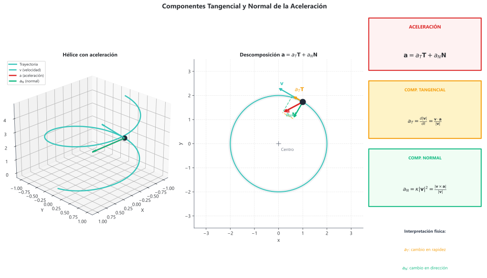

# Teoría — Funciones vectoriales de una variable real
## 3.1 Definición y representación

### Concepto intuitivo
Una **función vectorial** asigna a cada valor de un parámetro real $t$ un vector en el espacio. Describe la trayectoria de una partícula: dado el tiempo, devuelve la posición.

### Definición formal
Una **función vectorial** $\mathbf{r}: I \subseteq \mathbb{R} \to \mathbb{R}^n$ es:
$$\mathbf{r}(t) = \langle x(t), y(t), z(t) \rangle = x(t)\mathbf{i} + y(t)\mathbf{j} + z(t)\mathbf{k}$$

donde $x(t)$, $y(t)$, $z(t)$ son las **funciones componentes** (escalares).

### Dominio
El dominio de $\mathbf{r}(t)$ es la intersección de los dominios de sus componentes:
$$\text{Dom}(\mathbf{r}) = \text{Dom}(x) \cap \text{Dom}(y) \cap \text{Dom}(z)$$

### Curva en el espacio
La imagen de $\mathbf{r}(t)$ es una **curva en el espacio** (o curva espacial). El parámetro $t$ determina la **orientación**: el sentido en que se recorre la curva al aumentar $t$.

### Ejemplos fundamentales

| Curva | Parametrización |
|-------|-----------------|
| Recta por $P_0$ con dirección $\mathbf{v}$ | $\mathbf{r}(t) = \mathbf{r}_0 + t\mathbf{v}$ |
| Hélice circular | $\mathbf{r}(t) = \langle a\cos t, a\sin t, bt \rangle$ |
| Círculo en el plano $z = c$ | $\mathbf{r}(t) = \langle a\cos t, a\sin t, c \rangle$ |
| Curva de Viviani | $\mathbf{r}(t) = \langle a(1+\cos t), a\sin t, 2a\sin(t/2) \rangle$ |

*Figura 3.1.1: Ejemplos de curvas espaciales: hélice circular, curva de Viviani, y círculo en un plano horizontal.*

---

## 3.2 Límites y continuidad

### Límite de una función vectorial

$$\lim_{t \to a} \mathbf{r}(t) = \left\langle \lim_{t \to a} x(t), \lim_{t \to a} y(t), \lim_{t \to a} z(t) \right\rangle$$

El límite existe si y solo si existen los límites de cada componente.

### Continuidad

$\mathbf{r}(t)$ es **continua** en $t = a$ si:
1. $\mathbf{r}(a)$ está definida
2. $\lim_{t \to a} \mathbf{r}(t)$ existe
3. $\lim_{t \to a} \mathbf{r}(t) = \mathbf{r}(a)$

**Equivalentemente**: $\mathbf{r}(t)$ es continua si y solo si cada componente es continua.

### Curva suave

Una curva es **suave** si $\mathbf{r}'(t)$ existe, es continua y $\mathbf{r}'(t) \neq \mathbf{0}$ para todo $t$ en el intervalo. Es **suave a trozos** si se puede dividir en un número finito de segmentos suaves.

---

## 3.3 Derivada de funciones vectoriales

### Definición

$$\mathbf{r}'(t) = \lim_{h \to 0} \frac{\mathbf{r}(t+h) - \mathbf{r}(t)}{h}$$

### Cálculo por componentes

$$\mathbf{r}'(t) = \langle x'(t), y'(t), z'(t) \rangle$$

La derivada existe si y solo si existen las derivadas de cada componente.

### Interpretación geométrica

- $\mathbf{r}'(t)$ es el **vector tangente** a la curva en el punto $\mathbf{r}(t)$
- Apunta en la dirección del movimiento (según la orientación)
- $\mathbf{r}'(t) \neq \mathbf{0}$ garantiza que la tangente está bien definida

### Interpretación física (cinemática)

| Cantidad | Símbolo | Definición |
|----------|---------|------------|
| **Posición** | $\mathbf{r}(t)$ | Vector del origen al punto |
| **Velocidad** | $\mathbf{v}(t) = \mathbf{r}'(t)$ | Tasa de cambio de posición |
| **Rapidez** | $v = \lVert \mathbf{v}(t) \rVert$ | Magnitud de la velocidad |
| **Aceleración** | $\mathbf{a}(t) = \mathbf{v}'(t) = \mathbf{r}''(t)$ | Tasa de cambio de velocidad |

### Reglas de derivación

| Regla | Fórmula |
|-------|---------|
| Suma | $[\mathbf{u}(t) + \mathbf{v}(t)]' = \mathbf{u}'(t) + \mathbf{v}'(t)$ |
| Escalar constante | $[c\mathbf{u}(t)]' = c\mathbf{u}'(t)$ |
| Producto por función escalar | $[f(t)\mathbf{u}(t)]' = f'(t)\mathbf{u}(t) + f(t)\mathbf{u}'(t)$ |
| Producto escalar | $[\mathbf{u}(t) \cdot \mathbf{v}(t)]' = \mathbf{u}'(t) \cdot \mathbf{v}(t) + \mathbf{u}(t) \cdot \mathbf{v}'(t)$ |
| Producto vectorial | $[\mathbf{u}(t) \times \mathbf{v}(t)]' = \mathbf{u}'(t) \times \mathbf{v}(t) + \mathbf{u}(t) \times \mathbf{v}'(t)$ |
| Regla de la cadena | $[\mathbf{r}(f(t))]' = \mathbf{r}'(f(t)) \cdot f'(t)$ |

**Nota importante**: En el producto vectorial, el orden es crucial (no es conmutativo).

### Propiedades útiles

Si $\lVert \mathbf{r}(t) \rVert = c$ (constante), entonces:
$$\mathbf{r}(t) \cdot \mathbf{r}'(t) = 0$$

**Interpretación**: Si un vector tiene magnitud constante, su derivada es perpendicular a él.

---

## 3.4 Integrales de funciones vectoriales

### Integral indefinida

$$\int \mathbf{r}(t)\, dt = \left\langle \int x(t)\, dt, \int y(t)\, dt, \int z(t)\, dt \right\rangle + \mathbf{C}$$

donde $\mathbf{C} = \langle C_1, C_2, C_3 \rangle$ es un vector constante.

### Integral definida

$$\int_a^b \mathbf{r}(t)\, dt = \left\langle \int_a^b x(t)\, dt, \int_a^b y(t)\, dt, \int_a^b z(t)\, dt \right\rangle$$

### Teorema fundamental

$$\int_a^b \mathbf{r}'(t)\, dt = \mathbf{r}(b) - \mathbf{r}(a)$$

### Aplicación: recuperar posición desde velocidad

Dado $\mathbf{v}(t)$ y la condición inicial $\mathbf{r}(t_0) = \mathbf{r}_0$:
$$\mathbf{r}(t) = \mathbf{r}_0 + \int_{t_0}^t \mathbf{v}(u)\, du$$

---

## 3.5 Longitud de arco

### Fórmula de longitud

La longitud de la curva $\mathbf{r}(t)$ desde $t = a$ hasta $t = b$ es:
$$L = \int_a^b \lVert \mathbf{r}'(t) \rVert\, dt = \int_a^b \sqrt{[x'(t)]^2 + [y'(t)]^2 + [z'(t)]^2}\, dt$$

### Función longitud de arco

$$s(t) = \int_a^t \lVert \mathbf{r}'(u) \rVert\, du$$

Mide la distancia recorrida desde $t = a$ hasta $t$.

### Relación diferencial

$$\frac{ds}{dt} = \lVert \mathbf{r}'(t) \rVert$$

**Interpretación**: La rapidez es la tasa de cambio de la longitud de arco.

### Reparametrización por longitud de arco

Si $s = s(t)$ es invertible, podemos escribir $t = t(s)$ y definir:
$$\tilde{\mathbf{r}}(s) = \mathbf{r}(t(s))$$

**Propiedad clave**: $\left\lVert \frac{d\tilde{\mathbf{r}}}{ds} \right\rVert = 1$ (la curva se recorre a "velocidad unitaria").

*Figura 3.5.1: Longitud de arco como suma de pequeños segmentos $\Delta s$ a lo largo de la curva.*

---

## 3.6 Marco de Frenet-Serret (TNB)

### Vector tangente unitario

$$\mathbf{T}(t) = \frac{\mathbf{r}'(t)}{\lVert \mathbf{r}'(t) \rVert}$$

Siempre tiene magnitud 1 y apunta en la dirección del movimiento.

### Vector normal principal

$$\mathbf{N}(t) = \frac{\mathbf{T}'(t)}{\lVert \mathbf{T}'(t) \rVert}$$

- Perpendicular a $\mathbf{T}$
- Apunta hacia el "centro de curvatura"
- Indica hacia dónde "gira" la curva

### Vector binormal

$$\mathbf{B}(t) = \mathbf{T}(t) \times \mathbf{N}(t)$$

- Perpendicular tanto a $\mathbf{T}$ como a $\mathbf{N}$
- $\{\mathbf{T}, \mathbf{N}, \mathbf{B}\}$ forman una base ortonormal dextrógira

### Planos asociados

| Plano | Vectores que lo definen | Descripción |
|-------|-------------------------|-------------|
| **Osculador** | $\mathbf{T}$ y $\mathbf{N}$ | Plano de mejor ajuste local |
| **Normal** | $\mathbf{N}$ y $\mathbf{B}$ | Perpendicular a la tangente |
| **Rectificante** | $\mathbf{T}$ y $\mathbf{B}$ | Perpendicular a la normal |

*Figura 3.6.1: Marco móvil de Frenet-Serret: vectores Tangente ($\mathbf{T}$), Normal ($\mathbf{N}$) y Binormal ($\mathbf{B}$) a lo largo de una hélice.*

### Fórmulas de Frenet-Serret

$$\frac{d\mathbf{T}}{ds} = \kappa\mathbf{N}$$
$$\frac{d\mathbf{N}}{ds} = -\kappa\mathbf{T} + \tau\mathbf{B}$$
$$\frac{d\mathbf{B}}{ds} = -\tau\mathbf{N}$$

donde $\kappa$ es la curvatura y $\tau$ es la torsión.

---

## 3.7 Curvatura

### Definición geométrica

La **curvatura** $\kappa$ mide qué tan rápido cambia la dirección de la tangente:
$$\kappa = \left\lVert \frac{d\mathbf{T}}{ds} \right\rVert$$

- $\kappa$ grande: la curva "gira mucho"
- $\kappa$ pequeño: la curva es casi recta
- $\kappa = 0$: recta

### Fórmulas de curvatura

| Situación | Fórmula |
|-----------|---------|
| Parámetro general $t$ | $\kappa = \frac{\lVert \mathbf{T}'(t) \rVert}{\lVert \mathbf{r}'(t) \rVert}$ |
| Fórmula práctica | $\kappa = \frac{\lVert \mathbf{r}'(t) \times \mathbf{r}''(t) \rVert}{\lVert \mathbf{r}'(t) \rVert^3}$ |
| Curva plana $y = f(x)$ | $\kappa = \frac{|y''|}{[1 + (y')^2]^{3/2}}$ |
| Curva paramétrica plana | $\kappa = \frac{|x'y'' - y'x''|}{[(x')^2 + (y')^2]^{3/2}}$ |

### Radio de curvatura

$$\rho = \frac{1}{\kappa}$$

El **círculo osculador** tiene radio $\rho$ y centro en el **centro de curvatura**.

### Centro de curvatura

$$\text{Centro} = \mathbf{r}(t) + \rho\mathbf{N}(t)$$

*Figura 3.7.1: Curvatura $\kappa$ y círculo osculador de radio $\rho = 1/\kappa$ tangente a la curva en el punto de contacto.*

---

## 3.8 Torsión

### Definición

La **torsión** $\tau$ mide qué tan rápido la curva "se sale" del plano osculador:
$$\tau = -\frac{d\mathbf{B}}{ds} \cdot \mathbf{N}$$

### Fórmula práctica

$$\tau = \frac{(\mathbf{r}' \times \mathbf{r}'') \cdot \mathbf{r}'''}{\lVert \mathbf{r}' \times \mathbf{r}'' \rVert^2}$$

### Interpretación

- $\tau > 0$: la curva "gira a la derecha" saliendo del plano
- $\tau < 0$: la curva "gira a la izquierda" saliendo del plano
- $\tau = 0$: curva plana (contenida en un plano)

---

## 3.9 Componentes de la aceleración

### Descomposición TNB

La aceleración se puede expresar en términos de $\mathbf{T}$ y $\mathbf{N}$:
$$\mathbf{a} = a_T\mathbf{T} + a_N\mathbf{N}$$

### Componente tangencial

$$a_T = \frac{d^2s}{dt^2} = \frac{d}{dt}\lVert \mathbf{v} \rVert = \frac{\mathbf{v} \cdot \mathbf{a}}{\lVert \mathbf{v} \rVert}$$

**Interpretación**: Mide el cambio en la rapidez (aceleración/desaceleración).

### Componente normal (centrípeta)

$$a_N = \kappa \left(\frac{ds}{dt}\right)^2 = \kappa v^2 = \frac{\lVert \mathbf{v} \times \mathbf{a} \rVert}{\lVert \mathbf{v} \rVert}$$

**Interpretación**: Mide el cambio en la dirección (asociada a la curvatura).

### Relación con la magnitud

$$\lVert \mathbf{a} \rVert^2 = a_T^2 + a_N^2$$

### Aplicación física

- En movimiento circular uniforme: $a_T = 0$, solo hay $a_N$ (centrípeta)
- En movimiento rectilíneo: $a_N = 0$, solo hay $a_T$

*Figura 3.9.1: Descomposición de la aceleración en componentes tangencial ($a_T$) y normal ($a_N$).*

---

## 3.10 Movimiento de proyectiles

### Modelo básico (sin resistencia del aire)

$$\mathbf{a}(t) = \langle 0, 0, -g \rangle$$

### Solución general

Con velocidad inicial $\mathbf{v}_0 = \langle v_{0x}, v_{0y}, v_{0z} \rangle$ y posición inicial $\mathbf{r}_0$:

$$\mathbf{v}(t) = \langle v_{0x}, v_{0y}, v_{0z} - gt \rangle$$
$$\mathbf{r}(t) = \langle v_{0x}t, v_{0y}t, v_{0z}t - \frac{1}{2}gt^2 \rangle + \mathbf{r}_0$$

### Parámetros del movimiento parabólico (2D)

| Cantidad | Fórmula |
|----------|---------|
| Alcance máximo | $R = \frac{v_0^2 \sin(2\theta)}{g}$ |
| Altura máxima | $H = \frac{v_0^2 \sin^2\theta}{2g}$ |
| Tiempo de vuelo | $T = \frac{2v_0 \sin\theta}{g}$ |

---

<!--
IA: Esta teoría cubre funciones vectoriales, TNB, curvatura y torsión.
Usa las definiciones y fórmulas aquí como referencia canónica.
Al generar problemas, verifica que el estudiante domine cada sección.
file_id: CV-03-Teoria-Vectoriales
-->