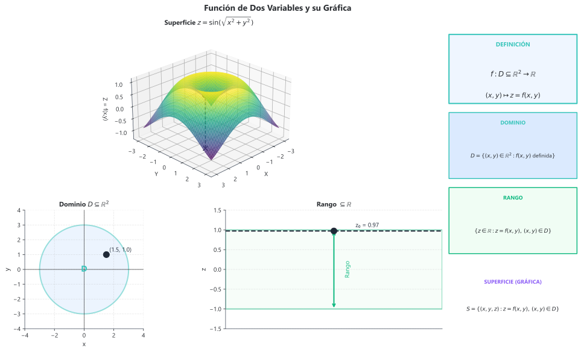

<!--
yaml_frontmatter:
  id: 'funciones_de_varias_variables'
  content_path: 'content/04_calculo_vectorial/04_funciones_de_varias_variables/funciones_de_varias_variables.md'
  metadata_path: 'metadata/content/04_calculo_vectorial/04_funciones_de_varias_variables/funciones_de_varias_variables.json'
  source_of_truth: 'metadata/content/*.json'
  title: 'Teoría de Funciones de Varias Variables'
  key_headings:
    - 'Teoría — Funciones reales de varias variables'
    - '4.1 Funciones de varias variables'
    - 'Definición'
    - 'Dominio y rango'
    - 'Gráfica'
    - 'Curvas de nivel'
    - 'Superficies de nivel'
    - '4.2 Límites y continuidad'
  key_concepts:
    - 'Derivadas parciales'
    - 'Vector gradiente'
    - 'Derivada direccional'
    - 'Plano tangente'
    - 'Multiplicadores de Lagrange'
-->
# Teoría — Funciones reales de varias variables
## 4.1 Funciones de varias variables

### Definición

Una **función de dos variables** es una regla $f: D \subseteq \mathbb{R}^2 \to \mathbb{R}$ que asigna a cada par ordenado $(x, y)$ en el dominio $D$ un único número real $z = f(x, y)$.

Análogamente, una **función de tres variables** $f: D \subseteq \mathbb{R}^3 \to \mathbb{R}$ asigna $w = f(x, y, z)$.

### Dominio y rango

- **Dominio**: conjunto de puntos $(x, y)$ donde $f$ está definida
- **Rango**: conjunto de valores $z$ que toma $f$

### Gráfica

La **gráfica** de $z = f(x, y)$ es la superficie en $\mathbb{R}^3$:
$$S = \{(x, y, z) \in \mathbb{R}^3 : z = f(x, y), (x, y) \in D\}$$

### Curvas de nivel

Las **curvas de nivel** de $f(x, y)$ son las curvas en el plano $xy$ donde $f$ es constante:
$$C_k = \{(x, y) : f(x, y) = k\}$$

**Interpretación**: Como las líneas de un mapa topográfico.

### Superficies de nivel

Para $f(x, y, z)$, las **superficies de nivel** son:
$$S_k = \{(x, y, z) : f(x, y, z) = k\}$$

*Figura 4.1.1: Gráfica de $z = f(x,y)$ como superficie en $\mathbb{R}^3$ con curvas de nivel proyectadas en el plano $xy$.*

---

## 4.2 Límites y continuidad

### Límite de una función de dos variables

$$\lim_{(x,y) \to (a,b)} f(x, y) = L$$

significa que $f(x, y)$ se aproxima a $L$ cuando $(x, y)$ se acerca a $(a, b)$ **por cualquier trayectoria**.

### Definición formal (épsilon-delta)

Para todo $\varepsilon > 0$ existe $\delta > 0$ tal que:
$$0 < \sqrt{(x-a)^2 + (y-b)^2} < \delta \implies |f(x,y) - L| < \varepsilon$$

### Técnicas para evaluar límites

1. **Sustitución directa** (si $f$ es continua)
2. **Coordenadas polares**: $x = a + r\cos\theta$, $y = b + r\sin\theta$, luego $r \to 0$
3. **Acotamiento** (teorema del sándwich)

### Demostración de no existencia

Si diferentes trayectorias dan diferentes límites, el límite **no existe**.

**Trayectorias comunes**:
- $y = mx$ (rectas por el origen)
- $y = x^2$ (parábola)
- $x = 0$ o $y = 0$ (ejes)

### Continuidad

$f$ es **continua** en $(a, b)$ si:
1. $f(a, b)$ existe
2. $\lim_{(x,y) \to (a,b)} f(x, y)$ existe
3. $\lim_{(x,y) \to (a,b)} f(x, y) = f(a, b)$

### Continuidad de funciones compuestas

Si $f$ es continua en $(a, b)$ y $g$ es continua en $f(a, b)$, entonces $g \circ f$ es continua en $(a, b)$.

---

## 4.3 Derivadas parciales

### Definición

$$f_x(x, y) = \frac{\partial f}{\partial x} = \lim_{h \to 0} \frac{f(x+h, y) - f(x, y)}{h}$$

$$f_y(x, y) = \frac{\partial f}{\partial y} = \lim_{h \to 0} \frac{f(x, y+h) - f(x, y)}{h}$$

### Cálculo práctico

- Para $f_x$: derivar respecto a $x$ tratando $y$ como constante
- Para $f_y$: derivar respecto a $y$ tratando $x$ como constante

### Interpretación geométrica

- $f_x(a, b)$: pendiente de la curva de intersección de la superficie con el plano $y = b$
- $f_y(a, b)$: pendiente de la curva de intersección de la superficie con el plano $x = a$

### Notaciones alternativas

$$f_x = \frac{\partial f}{\partial x} = \partial_x f = D_x f = f_1$$

### Derivadas parciales de orden superior

$$f_{xx} = \frac{\partial^2 f}{\partial x^2} = \frac{\partial}{\partial x}\left(\frac{\partial f}{\partial x}\right)$$

$$f_{xy} = \frac{\partial^2 f}{\partial y \partial x} = \frac{\partial}{\partial y}\left(\frac{\partial f}{\partial x}\right)$$

### Teorema de Clairaut (Schwarz)

Si $f_{xy}$ y $f_{yx}$ son continuas en una región abierta, entonces:
$$f_{xy} = f_{yx}$$

---

## 4.4 Diferenciabilidad

### Definición

$f(x, y)$ es **diferenciable** en $(a, b)$ si:
$$\Delta f = f_x(a,b)\Delta x + f_y(a,b)\Delta y + \varepsilon_1\Delta x + \varepsilon_2\Delta y$$

donde $\varepsilon_1, \varepsilon_2 \to 0$ cuando $(\Delta x, \Delta y) \to (0, 0)$.

### Condición suficiente

Si $f_x$ y $f_y$ existen y son **continuas** en un disco abierto alrededor de $(a, b)$, entonces $f$ es diferenciable en $(a, b)$.

### Relación con continuidad

$$\text{Diferenciable} \implies \text{Continua}$$

Pero continua NO implica diferenciable (y existencia de parciales NO implica diferenciable).

### Diferencial total

$$df = \frac{\partial f}{\partial x}dx + \frac{\partial f}{\partial y}dy$$

Para tres variables:
$$df = f_x\,dx + f_y\,dy + f_z\,dz$$

### Aproximación lineal

$$f(x, y) \approx f(a, b) + f_x(a, b)(x - a) + f_y(a, b)(y - b)$$

válida cerca de $(a, b)$.

### Plano tangente

El **plano tangente** a la superficie $z = f(x, y)$ en $(a, b, f(a,b))$:
$$z - f(a,b) = f_x(a,b)(x - a) + f_y(a,b)(y - b)$$

*Figura 4.4.1: Plano tangente a una superficie en un punto, con gradiente $\nabla f$ perpendicular a las curvas de nivel.*

---

## 4.5 Regla de la cadena

### Caso 1: Una variable independiente

Si $z = f(x, y)$ con $x = x(t)$, $y = y(t)$:
$$\frac{dz}{dt} = \frac{\partial f}{\partial x}\frac{dx}{dt} + \frac{\partial f}{\partial y}\frac{dy}{dt}$$

### Caso 2: Dos variables independientes

Si $z = f(x, y)$ con $x = x(s, t)$, $y = y(s, t)$:
$$\frac{\partial z}{\partial s} = \frac{\partial f}{\partial x}\frac{\partial x}{\partial s} + \frac{\partial f}{\partial y}\frac{\partial y}{\partial s}$$
$$\frac{\partial z}{\partial t} = \frac{\partial f}{\partial x}\frac{\partial x}{\partial t} + \frac{\partial f}{\partial y}\frac{\partial y}{\partial t}$$

### Caso general

Usar **diagramas de árbol** para identificar todas las dependencias.

### Derivación implícita

Si $F(x, y, z) = 0$ define $z$ implícitamente como función de $x$ e $y$:
$$\frac{\partial z}{\partial x} = -\frac{F_x}{F_z}, \quad \frac{\partial z}{\partial y} = -\frac{F_y}{F_z}$$

(siempre que $F_z \neq 0$).

---

## 4.6 Gradiente y derivada direccional

### Vector gradiente

$$\nabla f = \text{grad } f = \left\langle \frac{\partial f}{\partial x}, \frac{\partial f}{\partial y} \right\rangle$$

En tres variables:
$$\nabla f = \left\langle \frac{\partial f}{\partial x}, \frac{\partial f}{\partial y}, \frac{\partial f}{\partial z} \right\rangle$$

### Propiedades del gradiente

1. **Dirección de máximo crecimiento**: $\nabla f$ apunta en la dirección donde $f$ crece más rápido
2. **Magnitud**: $\lVert \nabla f \rVert$ es la tasa máxima de cambio
3. **Perpendicular a curvas de nivel**: $\nabla f \perp$ a las curvas $f(x,y) = k$

### Derivada direccional

La tasa de cambio de $f$ en la dirección del vector unitario $\mathbf{u}$:
$$D_{\mathbf{u}}f = \nabla f \cdot \mathbf{u} = \lVert \nabla f \rVert \cos\theta$$

donde $\theta$ es el ángulo entre $\nabla f$ y $\mathbf{u}$.

### Valores extremos de la derivada direccional

| Dirección | Valor de $D_\mathbf{u}f$ |
|-----------|--------------------------|
| $\mathbf{u} = \frac{\nabla f}{\lVert \nabla f \rVert}$ | $\lVert \nabla f \rVert$ (máximo) |
| $\mathbf{u} = -\frac{\nabla f}{\lVert \nabla f \rVert}$ | $-\lVert \nabla f \rVert$ (mínimo) |
| $\mathbf{u} \perp \nabla f$ | $0$ (sin cambio) |

*Figura 4.6.1: El vector gradiente $\nabla f$ apunta en la dirección de máximo crecimiento, perpendicular a las curvas de nivel.*

---

## 4.7 Planos tangentes y rectas normales

### Superficie como gráfica: $z = f(x, y)$

**Plano tangente** en $(a, b, f(a,b))$:
$$z - f(a,b) = f_x(a,b)(x-a) + f_y(a,b)(y-b)$$

**Vector normal**:
$$\mathbf{n} = \langle f_x(a,b), f_y(a,b), -1 \rangle$$

### Superficie como nivel: $F(x, y, z) = k$

**Vector normal**:
$$\mathbf{n} = \nabla F = \langle F_x, F_y, F_z \rangle$$

**Plano tangente** en $(x_0, y_0, z_0)$:
$$F_x(x-x_0) + F_y(y-y_0) + F_z(z-z_0) = 0$$

**Recta normal**:
$$\frac{x - x_0}{F_x} = \frac{y - y_0}{F_y} = \frac{z - z_0}{F_z}$$

---

## 4.8 Extremos de funciones de varias variables

### Extremos locales

- **Máximo local**: $f(a,b) \geq f(x,y)$ para todo $(x,y)$ cerca de $(a,b)$
- **Mínimo local**: $f(a,b) \leq f(x,y)$ para todo $(x,y)$ cerca de $(a,b)$

### Puntos críticos

$(a, b)$ es **punto crítico** si:
- $\nabla f(a,b) = \mathbf{0}$, es decir, $f_x(a,b) = 0$ y $f_y(a,b) = 0$
- O alguna derivada parcial no existe

### Teorema de Fermat (generalizado)

Si $f$ tiene un extremo local en $(a, b)$ y las derivadas parciales existen, entonces:
$$f_x(a, b) = 0 \quad \text{y} \quad f_y(a, b) = 0$$

### Criterio de la segunda derivada (Test de la Hessiana)

Sea $D$ el **discriminante** o **Hessiano**:
$$D = D(a,b) = f_{xx}(a,b)f_{yy}(a,b) - [f_{xy}(a,b)]^2$$

| Condición | Conclusión |
|-----------|------------|
| $D > 0$ y $f_{xx} > 0$ | Mínimo local |
| $D > 0$ y $f_{xx} < 0$ | Máximo local |
| $D < 0$ | Punto silla |
| $D = 0$ | Test no concluyente |

### Punto silla

Un punto crítico donde $f$ no tiene extremo local. La superficie tiene forma de "silla de montar".

### Matriz Hessiana

$$H = \begin{pmatrix} f_{xx} & f_{xy} \\ f_{yx} & f_{yy} \end{pmatrix}$$

$D = \det(H)$

*Figura 4.8.1: Clasificación de puntos críticos: mínimo local ($D>0, f_{xx}>0$), máximo local ($D>0, f_{xx}<0$) y punto silla ($D<0$).*

---

## 4.9 Extremos absolutos

### Teorema de valores extremos

Si $f$ es continua en una región cerrada y acotada $D$, entonces $f$ alcanza un máximo absoluto y un mínimo absoluto en $D$.

### Procedimiento para encontrar extremos absolutos

1. Encontrar valores de $f$ en los puntos críticos **interiores**
2. Encontrar valores extremos de $f$ en la **frontera** de $D$
3. Comparar todos los valores; el mayor es el máximo absoluto, el menor es el mínimo

### Optimización en la frontera

Parametrizar la frontera y reducir a optimización de una variable, o usar multiplicadores de Lagrange.

---

## 4.10 Multiplicadores de Lagrange

### Problema de optimización con restricciones

Optimizar $f(x, y, z)$ sujeto a $g(x, y, z) = k$.

### Método de Lagrange

Los puntos extremos ocurren donde:
$$\nabla f = \lambda \nabla g$$

junto con la restricción $g(x, y, z) = k$.

**Sistema a resolver**:
$$\begin{cases}
f_x = \lambda g_x \\
f_y = \lambda g_y \\
f_z = \lambda g_z \\
g(x, y, z) = k
\end{cases}$$

### Interpretación geométrica

En un extremo condicionado, $\nabla f$ y $\nabla g$ son paralelos (las curvas/superficies de nivel son tangentes).

### Dos restricciones

Para optimizar $f$ sujeto a $g = k_1$ y $h = k_2$:
$$\nabla f = \lambda \nabla g + \mu \nabla h$$

junto con ambas restricciones.

### Interpretación del multiplicador

$\lambda$ representa la sensibilidad del valor óptimo respecto al cambio en la restricción:
$$\frac{d(\text{valor óptimo})}{dk} \approx \lambda$$

---

<!--
IA: Esta teoría cubre funciones de varias variables, derivadas parciales, gradiente y optimización.
Usa las definiciones y fórmulas aquí como referencia canónica.
Al generar problemas, verifica dominio de cada sección antes de avanzar.
file_id: CV-04-Teoria-Varias
-->

## Glosario de variables

| Simbolo | Nombre | Tipo | Unidad | Valor | Precision |
| --- | --- | --- | --- | --- | --- |
| x | Variable x | variable | N/A | N/A | N/A |
| y | Variable y | variable | N/A | N/A | N/A |
| z | Variable z | variable | N/A | N/A | N/A |
| t | Variable t | variable | N/A | N/A | N/A |
| n | Variable n | variable | N/A | N/A | N/A |
| k | Variable k | variable | N/A | N/A | N/A |
