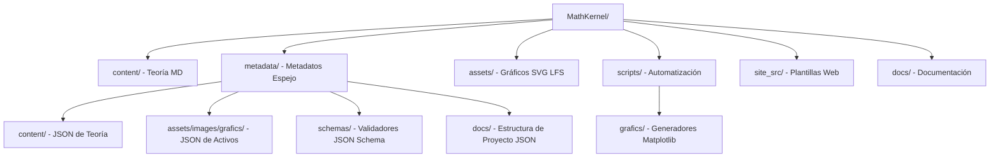

# Arquitectura técnica del repositorio: MathKernel

## 1. Propósito técnico

Este proyecto implementa una arquitectura de contenido desacoplada:

- **Capa de lectura humana:** Archivos Markdown en `content/` que contienen exclusivamente teoría matemática y fórmulas LaTeX. Se han eliminado metadatos internos y elementos de navegación para maximizar la legibilidad y portabilidad.
- **Capa de lectura por IA:** Archivos JSON en `metadata/` que proporcionan la estructura semántica, facilitando el procesamiento por agentes y sistemas automatizados.

## 2. Componentes

### 2.1 Capa de contenido (`content/`)
- **Formato:** Markdown puro.
- **Organización:** Estructura jerárquica por módulos.
- **Integridad:** Las imágenes se inyectan automáticamente mediante scripts basados en metadatos, evitando el hardcoding manual.

### 2.2 Capa de metadatos (`metadata/`)
- **Estructura Espejo (Homóloga):**
    - `metadata/content/`: Réplica exacta de `content/`. Cada `.md` tiene un `.json`.
    - `metadata/assets/images/grafics/`: Réplica de los activos visuales. Cada `.svg` tiene un `.json`.
- **Esquemas de Validación (`metadata/schemas/`):**
    - `content.schema.json`: Rige la teoría (id, title, concepts, etc.).
    - `assets.schema.json`: Rige los gráficos (id, topic_id, description, section, etc.).

### 2.3 Capa de generación y herramientas (`scripts/`)
- **`build.py`**: CLI único del proyecto. Orquesta el pipeline `Validar -> Linkear Assets -> Generar Sitio` y centraliza flags operativos (`--verbose`, `--continue-on-error`, `--skip-validation`, `--with-assets`).
- **`core/`**: Lógica de negocio pura desacoplada del filesystem (`validators.py`, `processors.py`, `generators.py`, `error_handling.py`).
- **`io/file_manager.py`**: Abstracción de entrada/salida para texto, JSON y operaciones de directorios.
- **`generate_assets.py`**: Generador de gráficos SVG invocado de forma opcional mediante el flag `--with-assets`.

### 2.4 Gestión de Activos
- **Git LFS:** Utilizado para rastrear archivos en `assets/images/grafics/`. Es crítico que el entorno de CI/CD (GitHub Actions) realice un `git lfs pull` para que los archivos reales estén disponibles durante la generación del sitio.
- **Formato Vectorial:** Se prioriza SVG. Las rutas en el sitio generado se ajustan dinámicamente de `../../../assets/` a `../../assets/` (o el nivel correspondiente) para mantener la compatibilidad entre el repositorio y la web.

## 3. Flujo de trabajo y Despliegue

1. **Creación:** Escribir teoría en `content/` o scripts de gráficos en `scripts/grafics/`.
2. **Build local:** Ejecutar `python scripts/build.py --verbose` para validar, vincular activos y generar el sitio.
3. **Build con assets:** Ejecutar `python scripts/build.py --with-assets --verbose` cuando se requiera regenerar gráficos SVG.
4. **CI/CD:** GitHub Actions descarga objetos LFS y ejecuta el build unificado antes de desplegar `site/`.

## 4. Estructura del Proyecto

Esta sección describe la organización física del repositorio, segmentada por tipo de consumo.

### 4.1 Árbol de directorios (IA-Ready)
Para un análisis exhaustivo por agentes de IA, se mantiene un registro completo de la estructura en formato JSON siguiendo la arquitectura homóloga de metadatos:
- **Referencia:** [metadata/docs/project_structure.json](../metadata/docs/project_structure.json)

### 4.2 Arquitectura simplificada (Lectura Humana)
A continuación se presenta la jerarquía principal del repositorio para facilitar la navegación rápida:

## 5. Configuración del Repositorio
- **Nombre:** MathKernel
- **Rama principal:** `main`
- **Sitio:** https://nerudev.github.io/MathKernel/

## 5. Recomendaciones de Evolución
- Mantener el desacoplamiento: no incluir información de formato o metadatos dentro de los archivos de teoría.
- Expandir el catálogo de conceptos en los archivos JSON para mejorar la indexación por parte de IAs.
- Asegurar que cualquier nuevo módulo siga la convención de nombrado `XX_nombre_modulo`.
